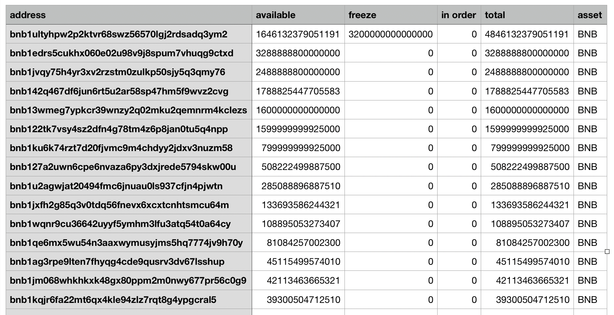

# 账户余额导出工具

## 介绍

**Balance Dumper**是用于导出在某一高度某个资产余额快照的工具。它需要在本地运行一个全节点。同步至指定高度后，分析数据库来得到用户资产详情。以上数据会被导出至一个CSV文件。 

## 安装

你可以使用以下安装脚本install.sh完成安装。安装细节：:

* Home目录在 ~/.bdumper
* 可执行文件安装位置为 /usr/local/bin (i.e. bairdrop or tbairdrop)

```
# One-line install
sh <(wget -qO- https://raw.githubusercontent.com/binance-chain/chain-tooling/airdrop/install.sh)
```

请注意需要在主网和测试网使用不同的可执行文件：`bairdrop` 用于主网，`tbairdrop` 用于测试网

确认下载安装成功：
```
$ bdumper --help
Balance Dumper

Usage:
  bdumper [flags]

Flags:
      --asset string    query asset 
      --height int      query height 
  -h, --help            help for bdumper
      --home string     directory for config and data (default "${HOME}/.bdumper")
  -o, --output string   directory for storing the csv file of balance result (default "${HOME}/.bdumper")
```

## 使用方法

**参数**
* height： 导出高度
* asset：指定资产
* home: 全节点主目录, 默认 `${HOME}/.bdumper`
* Output: 导出结果目录, 默认 `${HOME}/.bdumper`

例如，你需要得到56503900高度时BNB的分布快照，可以执行以下命令：
```
$ bdumper --height 56503900 --asset BNB --home ~/myhome -o ~/myoutput &
```
建议以后台形式运行此程序。

## 日志

导出日志将被保存在主目录下的 `dumper.log` 。例如：

```
$ bdumper --height 56503900 --asset BNB --home ~/myhome -o ~/myoutput &
===>got the block height at 00:00 UTC of the day, 56503807
===>start node,home = /Users/fletcher/.bdumper, stopAt = 56503900, StateSyncHeight = 56503807
===>node started from height = 0
===>syncing......
```

全节点同步期间将显示： *`'syncing......'`* 。你可以通过 `curl localhost:27147/stauts `检查同步情况

```
$ curl localhost:27147/status
{
  "jsonrpc": "2.0",
  "id": "",
  "result": {
    ......
    "sync_info": {
      ......
      "latest_block_height": "56503807", // the latest block height downloaded from peers
      "latest_block_time": "2019-12-22T00:00:00.414320569Z",
      "catching_up": true,
      "index_height": "0"
    },
    ......
  }
}
```
对于测试网，
```
$ curl localhost:26657/status
{
  "jsonrpc": "2.0",
  "id": "",
  "result": {
    ......
    "sync_info": {
      ......
      "latest_block_height": "56503807", // the latest block height downloaded from peers
      "latest_block_time": "2019-12-22T00:00:00.414320569Z",
      "catching_up": true,
      "index_height": "0"
    },
    ......
  }
}
```

 `latest_block_height` 为当前同步高度。

由于使用`state sync`， `latest_block_height`将从0很快增长为 0:00 UTC时的高度。当 `state sync`结束后，全节点将切换为`fast sync`模式。显示出以下信息表示同步完成。 
```
===>node catches up the target height 56503900, terminal the node
```

同步结束后将开始导出快照。
```
===>start to fetch at height = 56503900
===>finish fetching,got 107677 matched account
```

最终保存的文件为“资产名称+高度.csv”，例如 *BNB_56503900.csv*



>**注意资产金额需要扩大额e^8来表示小数。*bnb1edrs5cukhx060e02u98v9j8spum7vhuqg9ctxd* 的余额为*32888888BNB*.**

## 注意事项

- 主目录中的数据会根据每次导出高度不同而有所删减
- 如果你有一个本地运行的全节点，可以备份BNCHOME主目录用作导出快照
- 节点同步时间随着高度增加而增加
